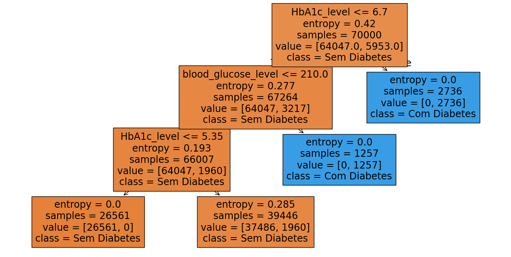
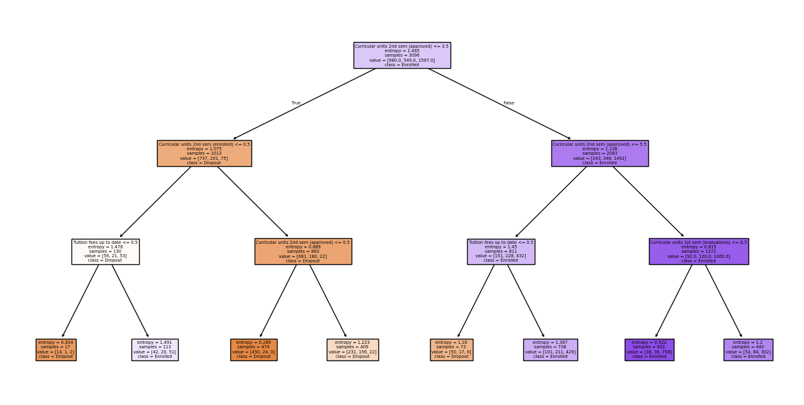
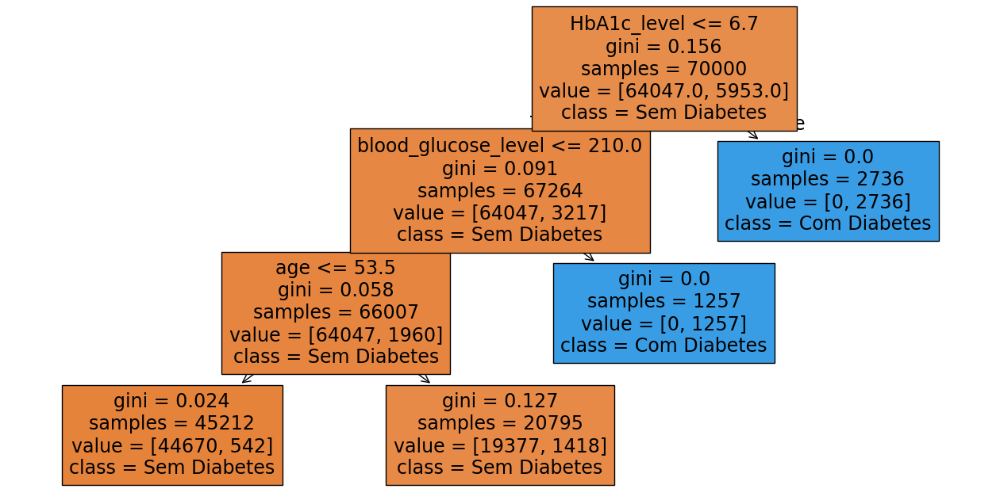
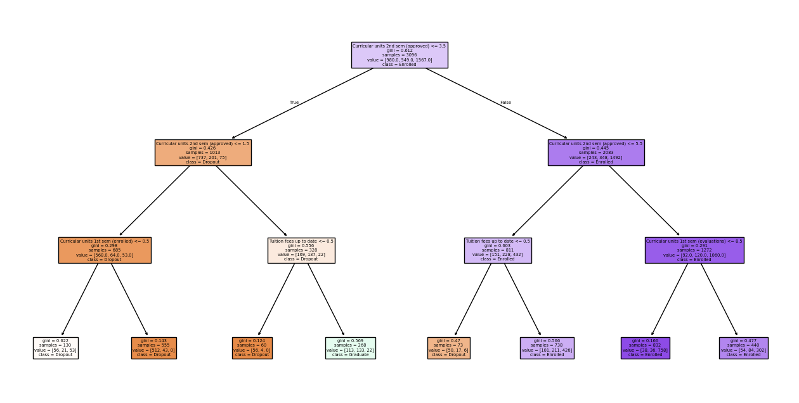

# Indução de Conhecimento: Árvores de Decisão e Regras

Este repositório contém a resolução em Python da **Questão 2** da Lista 1 da disciplina de Inteligência Artificial. O objetivo principal é construir bases de conhecimento a partir de bases de dados reais utilizando algoritmos de aprendizado de máquina.

A extração de conhecimento é feita através de duas abordagens:
1. **Árvores de Decisão** (Algoritmos CART e C4.5).
2. **Indução de Regras** (Algoritmo RIPPER, utilizado como alternativa moderna e compatível com dados contínuos ao algoritmo PRISM).

Os algoritmos foram aplicados em duas bases de dados públicas extraídas do Kaggle:
* [Diabetes Prediction Dataset](https://www.kaggle.com/datasets/iammustafatz/diabetes-prediction-dataset) - Saúde
* [Predict students' dropout and academic success](https://www.kaggle.com/datasets/thedevastator/higher-education-predictors-of-student-retention) - Educação

## Pré-requisitos

Para executar este projeto localmente, você precisará do Python instalado e das seguintes bibliotecas:

```pip install pandas scikit-learn matplotlib wittgenstein```


> Nota: A biblioteca `wittgenstein` é essencial para a execução do algoritmo RIPPER, que vai ser utilizado na Indução de Regras.

## O que o código faz?

O script `main.py` está dividido em duas partes principais, respondendo aos requisitos da atividade:

### 1. Indução de Árvores de Decisão
* Treina modelos de classificação usando os critérios **Gini** (para simular o CART) e **Entropia** (para simular o C4.5) através da biblioteca `scikit-learn`.
* Extrai a base de conhecimento textual do terminal, mapeando os caminhos da árvore de decisão no formato lógico clássico (`SE... ENTÃO...`).
* Gera automaticamente e salva 4 imagens `.png` contendo os diagramas visuais das árvores geradas para ambas as bases de dados.

### 2. Indução de Regras de Decisão
* Utiliza o algoritmo **RIPPER** para induzir regras de classificação diretas.

    > Como o algoritmo PRISM clássico suporta apenas atributos categóricos discretos, o RIPPER foi adotado por ser sua evolução direta, capaz de lidar nativamente com os atributos numéricos contínuos presentes nas bases escolhidas (ex: Idade, IMC, Notas).
* E imprime no console um Ruleset formatado em português de fácil leitura ->`SE [condição] E [condição] ENTÃO Classe: [Alvo]`

## Saída Gerada6

Ao rodar o código, o código deve gerar as seguintes saídas

### [Diabetes] BASE DE CONHECIMENTO - REGRAS CART (GINI)
```SE HbA1c_level <= 6.70 E blood_glucose_level <= 210.00 E age <= 53.50 ENTÃO Classe: Sem Diabetes
SE HbA1c_level <= 6.70 E blood_glucose_level <= 210.00 E age > 53.50 ENTÃO Classe: Sem Diabetes
SE HbA1c_level <= 6.70 E blood_glucose_level > 210.00 ENTÃO Classe: Com Diabetes
SE HbA1c_level > 6.70 ENTÃO Classe: Com Diabetes
```

### [Diabetes] BASE DE CONHECIMENTO - REGRAS C4.5 (ENTROPIA)
``` 
SE HbA1c_level <= 6.70 E blood_glucose_level <= 210.00 E HbA1c_level <= 5.35 ENTÃO Classe: Sem Diabetes
SE HbA1c_level <= 6.70 E blood_glucose_level <= 210.00 E HbA1c_level > 5.35 ENTÃO Classe: Sem Diabetes
SE HbA1c_level <= 6.70 E blood_glucose_level > 210.00 ENTÃO Classe: Com Diabetes
SE HbA1c_level > 6.70 ENTÃO Classe: Com Diabetes
```

### [Students_Dropout] BASE DE CONHECIMENTO - REGRAS CART (GINI)
```SE Curricular units 2nd sem (approved) <= 3.50 E Curricular units 2nd sem (approved) <= 1.50 E Curricular units 1st sem (enrolled) <= 0.50 ENTÃO Classe: Dropout
SE Curricular units 2nd sem (approved) <= 3.50 E Curricular units 2nd sem (approved) <= 1.50 E Curricular units 1st sem (enrolled) > 0.50 ENTÃO Classe: Dropout
SE Curricular units 2nd sem (approved) <= 3.50 E Curricular units 2nd sem (approved) > 1.50 E Tuition fees up to date <= 0.50 ENTÃO Classe: Dropout
SE Curricular units 2nd sem (approved) <= 3.50 E Curricular units 2nd sem (approved) > 1.50 E Tuition fees up to date > 0.50 ENTÃO Classe: Graduate
SE Curricular units 2nd sem (approved) > 3.50 E Curricular units 2nd sem (approved) <= 5.50 E Tuition fees up to date <= 0.50 ENTÃO Classe: Dropout
SE Curricular units 2nd sem (approved) > 3.50 E Curricular units 2nd sem (approved) <= 5.50 E Tuition fees up to date > 0.50 ENTÃO Classe: Enrolled
SE Curricular units 2nd sem (approved) > 3.50 E Curricular units 2nd sem (approved) > 5.50 E Curricular units 1st sem (evaluations) <= 8.50 ENTÃO Classe: Enrolled
SE Curricular units 2nd sem (approved) > 3.50 E Curricular units 2nd sem (approved) > 5.50 E Curricular units 1st sem (evaluations) > 8.50 ENTÃO Classe: Enrolled
```
### [Students_Dropout] BASE DE CONHECIMENTO - REGRAS C4.5 (ENTROPIA)

```
SE Curricular units 2nd sem (approved) <= 3.50 E Curricular units 2nd sem (enrolled) <= 0.50 E Tuition fees up to date <= 0.50 ENTÃO Classe: Dropout
SE Curricular units 2nd sem (approved) <= 3.50 E Curricular units 2nd sem (enrolled) <= 0.50 E Tuition fees up to date > 0.50 ENTÃO Classe: Enrolled
SE Curricular units 2nd sem (approved) <= 3.50 E Curricular units 2nd sem (enrolled) > 0.50 E Curricular units 2nd sem (approved) <= 0.50 ENTÃO Classe: Dropout
SE Curricular units 2nd sem (approved) <= 3.50 E Curricular units 2nd sem (enrolled) > 0.50 E Curricular units 2nd sem (approved) > 0.50 ENTÃO Classe: Dropout
SE Curricular units 2nd sem (approved) > 3.50 E Curricular units 2nd sem (approved) <= 5.50 E Tuition fees up to date <= 0.50 ENTÃO Classe: Dropout
SE Curricular units 2nd sem (approved) > 3.50 E Curricular units 2nd sem (approved) <= 5.50 E Tuition fees up to date > 0.50 ENTÃO Classe: Enrolled
SE Curricular units 2nd sem (approved) > 3.50 E Curricular units 2nd sem (approved) > 5.50 E Curricular units 1st sem (evaluations) <= 8.50 ENTÃO Classe: Enrolled
SE Curricular units 2nd sem (approved) > 3.50 E Curricular units 2nd sem (approved) > 5.50 E Curricular units 1st sem (evaluations) > 8.50 ENTÃO Classe: Enrolled

```

### ALGORITMO DE INDUÇÃO DE REGRAS (RIPPER)
```
[Diabetes] Base de Regras Geradas pelo RIPPER:
SE HbA1c_level >=  6.6 ENTÃO Classe: Com Diabetes
SE blood_glucose_level >=  200.0 ENTÃO Classe: Com Diabetes
SE hypertension = 1 E blood_glucose_level entre 159.0 e 200.0 E HbA1c_level entre 6.1 e 6.5 E bmi entre 27.17 e 27.32 E smoking_history = 4 E gender = 1 ENTÃO Classe: Com Diabetes
SE [Nenhuma das condições acima for atendida] ENTÃO Classe: Não Com Diabetes

[Students_Dropout] Base de Regras Geradas pelo RIPPER:
SE Curricularunits2ndsem(approved) <=  1.0 E Tuitionfeesuptodate = 0 E Displaced = 0 ENTÃO Classe: Dropout (Desistência)
SE Curricularunits2ndsem(approved) <=  1.0 E Applicationmode entre 8.0 e 12.0 E Debtor = 0 E Displaced = 1 ENTÃO Classe: Dropout (Desistência)
SE Curricularunits2ndsem(approved) <=  1.0 E Scholarshipholder = 0 E Fathersqualification entre 14.0 e 27.0 E Mothersqualification entre 13.0 e 22.0 E Displaced = 0 ENTÃO Classe: Dropout (Desistência)
SE Curricularunits2ndsem(approved) <=  1.0 E Curricularunits2ndsem(enrolled) entre 5.0 e 6.0 E Curricularunits2ndsem(evaluations) <=  5.0 ENTÃO Classe: Dropout (Desistência)
SE Curricularunits2ndsem(approved) <=  1.0 E Course entre 10.0 e 12.0 ENTÃO Classe: Dropout (Desistência)
SE Curricularunits2ndsem(approved) <=  1.0 E Displaced = 0 E Applicationmode entre 8.0 e 12.0 ENTÃO Classe: Dropout (Desistência)
SE Curricularunits2ndsem(grade) <=  10.0 E Course entre 7.0 e 9.0 E Curricularunits2ndsem(approved) <=  1.0 ENTÃO Classe: Dropout (Desistência)
SE Tuitionfeesuptodate = 0 E Curricularunits2ndsem(approved) entre 1.0 e 3.0 ENTÃO Classe: Dropout (Desistência)
SE Curricularunits2ndsem(approved) <=  1.0 E Tuitionfeesuptodate = 0 ENTÃO Classe: Dropout (Desistência)
SE Curricularunits2ndsem(grade) <=  10.0 E Curricularunits1stsem(enrolled) entre 5.0 e 6.0 E Unemploymentrate = 15.5 ENTÃO Classe: Dropout (Desistência)
SE Curricularunits2ndsem(approved) <=  1.0 E Course entre 12.0 e 14.0 ENTÃO Classe: Dropout (Desistência)
SE Curricularunits1stsem(approved) <=  2.0 E Course entre 6.0 e 7.0 E Applicationmode entre 4.0 e 8.0 ENTÃO Classe: Dropout (Desistência)
SE Curricularunits2ndsem(approved) entre 1.0 e 3.0 E Mothersqualification entre 13.0 e 22.0 E Curricularunits1stsem(approved) entre 2.0 e 4.0 ENTÃO Classe: Dropout (Desistência)
SE Curricularunits2ndsem(approved) <=  1.0 E Displaced = 0 ENTÃO Classe: Dropout (Desistência)
SE Curricularunits1stsem(approved) <=  2.0 E Curricularunits2ndsem(evaluations) >=  13.0 ENTÃO Classe: Dropout (Desistência)
SE Tuitionfeesuptodate = 0 E Displaced = 0 E Curricularunits2ndsem(credited) >=  1.0 ENTÃO Classe: Dropout (Desistência)
SE Debtor = 1 E Tuitionfeesuptodate = 0 ENTÃO Classe: Dropout (Desistência)
SE Curricularunits2ndsem(approved) entre 1.0 e 3.0 E Displaced = 1 E Curricularunits1stsem(approved) entre 2.0 e 4.0 E Gender = 1 E Mothersqualification <=  3.0 ENTÃO Classe: Dropout (Desistência)
SE Curricularunits2ndsem(grade) <=  10.0 E Course entre 14.0 e 16.0 ENTÃO Classe: Dropout (Desistência)
SE Curricularunits2ndsem(approved) entre 1.0 e 3.0 E Daytime/eveningattendance = 0 ENTÃO Classe: Dropout (Desistência)
SE Scholarshipholder = 0 E Curricularunits2ndsem(credited) >=  1.0 E Curricularunits2ndsem(approved) entre 4.0 e 5.0 E Gender = 1 ENTÃO Classe: Dropout (Desistência)
SE [Nenhuma das condições acima for atendida] ENTÃO Classe: Não Dropout (Desistência)
```

## Árvores de Decisão




